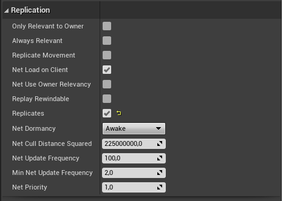
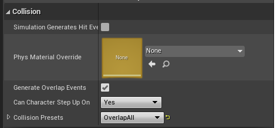
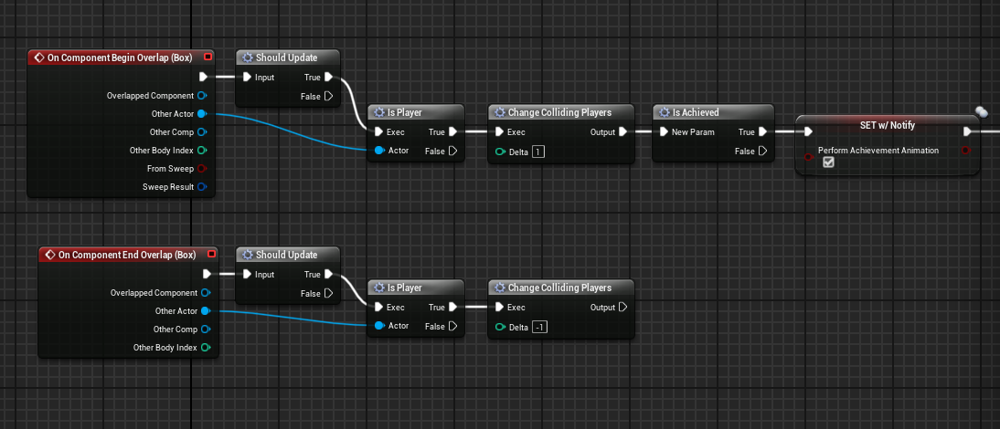
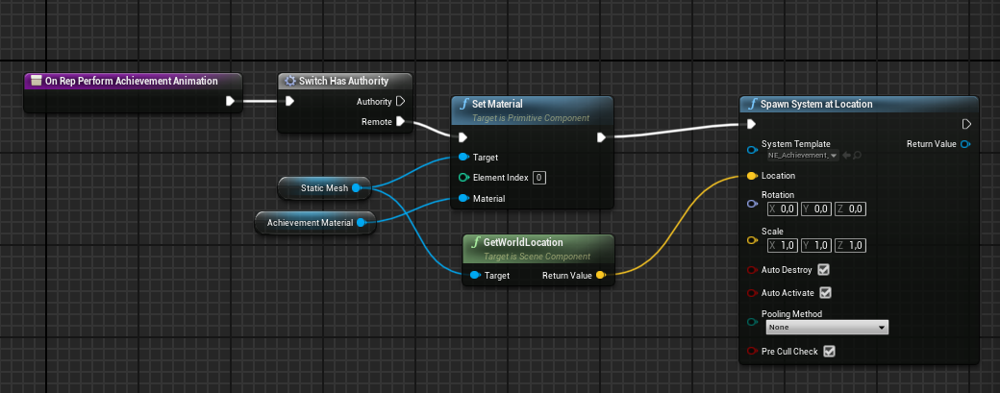

## Multiplayer 2

Se ha creado un Actor [AchievementActor](Content/ThirdPersonBP/Blueprints/AchievementActor.uasset) que tiene una malla estática y una caja de colisión. Este actor se replicará en los clientes.

Cuando dos jugadores entran en la caja de colisión se activa una propiedad que se replica con notificación a los clientes.

De esta manera el servidor ejecuta la lógica y notifica a los clientes del estado del actor.